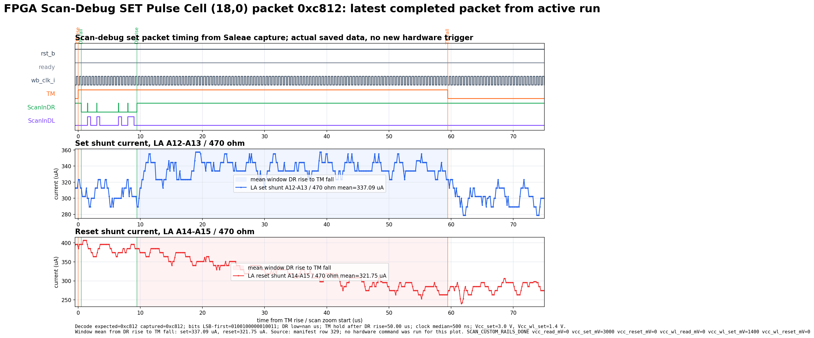
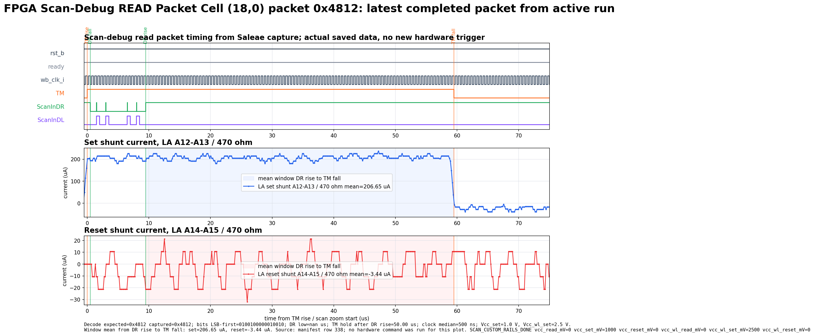

# Packet Level Measurement - 2026-08-24

Packet-level Saleae plots from the `r18c00` set sweep run. These plots were generated from saved capture files only; no extra hardware trigger was issued for this README.

## Set Packet

- Cell: `(18,0)`
- Packet: `0xc812`
- Manifest row: `329`
- Rails: `Vcc_set = 3.0 V`, `Vcc_wl_set = 1.4 V`
- Set shunt window mean: `337.09 uA`

## Read Packet

- Cell: `(18,0)`
- Packet: `0x4812`
- Manifest row: `338`
- Rails: `Vcc_set = 1.0 V`, `Vcc_wl_set = 2.5 V`
- Read/set-shunt window mean: `206.65 uA`

Note: the plotted current conversion uses the capture metadata shunt setting, `470 ohm`.
